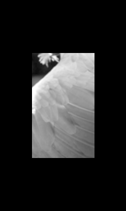

# Image Processing

Weave models image pipelines denotationally:

- an image is a coordinate-indexed function
- arithmetic filters are typed transformations of that function
- the first compiled subset lowers directly to MLIR without a public DAG layer

The public surface is intentionally small:

- `Image` is the semantic interface
- `ImageExt` provides built-in arithmetic combinators
- `View` is the local sampling primitive
- `Grid<T, N>` is owned storage

Pointwise arithmetic pipelines compose as normal Rust method chains:

```rust
use weave::{Grid, ImageExt, MeliorBackend};

let input = Grid::new([2, 2], vec![0.25_f32, 0.75, 1.0, -0.5]);

let output = (&input)
    .mul_const(2.0)
    .add_const(0.5)
    .threshold(1.0, 1.0, 0.0)
    .materialize_with::<MeliorBackend>()?;
```

In the current MLIR pass, only single-input `f32` pointwise arithmetic is lowered. Local `View`-based filters remain available semantically and run through the CPU path.


